# `did:webplus` Method Specification

#### Authors

-   Victor Dods ([LedgerDomain](https://ledgerdomain.com/))
-   Alex Colgan ([LedgerDomain](https://ledgerdomain.com/))

## Overview

The `did:web` method makes straightforward use of familiar tools across a wide range of use cases. However, heavily regulated ecosystems such as the pharmaceutical supply chain demand additional guarantees of immutability and auditability, including seamless key rotation and a key usage history. `did:webplus` is a proposed fit-for-purpose DID method for use within the pharma supply chain credentialing community, with an eye towards releasing it into the wild for those communities that are similarly situated.

Here is a [talk](https://www.youtube.com/watch?v=Ws55MlDuUGI) Victor Dods (Chief Software Architect at LedgerDomain) gave at LedgerPalooza 2024 (this is a yearly event hosted by LedgerPalooza for our colleagues and business friendlies) presenting `did:webplus`.  Here is the [slide deck](https://docs.google.com/presentation/d/1oZc4WABaG3zhw7gHclSIaQCgnchdWRJvqUDQLq4L-Ig/edit?usp=sharing) from that talk.

### Intended Audience for This Document

This document is intended for:
-   Developers who want to use, implement, or integrate `did:webplus` in software systems.
-   Digital identity ecosystem stakeholders who wish to understand the purposes and capabilities of `did:webplus`.

It is assumed that the reader is familiar with the concepts in the [DID spec](https://www.w3.org/TR/did-1.1/).  A familiarity with the [`did:web`](https://w3c-ccg.github.io/did-method-web/) method is useful to understand the context and motivation for `did:webplus`.

## Implementations

Rust implementation, licensed under the [MIT License](LICENSE) by LedgerDomain:
-   [`did:webplus` Verifiable Data Registry (VDR) service (reference implementation)](did-webplus/vdr/README.md)
-   [`did:webplus` Verifiable Data Gateway (VDG) service (reference implementation)](did-webplus/vdg/README.md)
-   [`did-webplus` CLI tool (reference implementation for DID controller and verifying party operations)](did-webplus/cli/README.md)

More information, as well as all source code, is available at <https://github.com/LedgerDomain/did-webplus>.

## `did:webplus` Architecture

In `did:webplus`, the basic scheme of `did:web` is extended using specific mechanisms that provide various qualitative and security advantages, detailed in [the `did:webplus` data model](#didwebplus-data-model).  The most salient extension provided by `did:webplus` is that of cryptographic verifiability of a DID's entire history of DID documents.  This means that in `did:webplus`, a verifying party doesn't have to trust the VDR to faithfully represent the DID documents -- the verifying party can verify the DID documents directly.

`did:webplus` has several levels of architecture that are suitable for different use cases.  Generally, the more locally-scoped the use case, the simpler the architecture.

### Background: `did:web` Architecture

The most rudimentary function of a DID is as follows.  Alice holds some private keys.  Bob wants to verify an artifact that Alice has signed with one of her private keys.  In order to verify Alice's signature, Bob needs the appropriate public key.  A DID is a mechanism by which Bob can retrieve Alice's public keys.

It will be useful to first describe the architecture for [`did:web`](https://w3c-ccg.github.io/did-method-web/), so that the specific extensions that `did:webplus` provides will be clear.  In this diagram, Alice is the DID Controller and Bob is the Verifying Party.

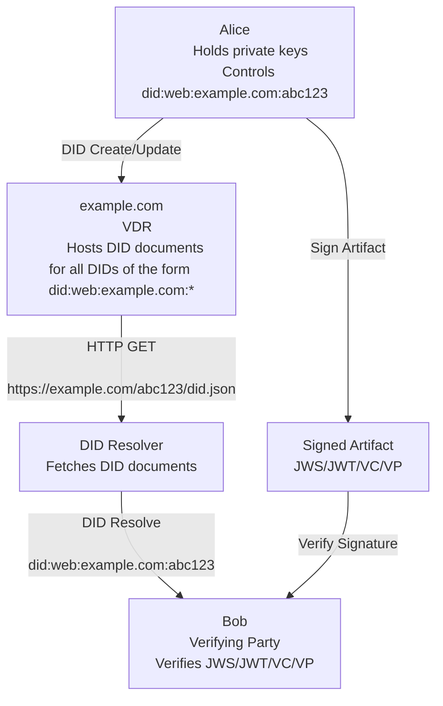

VDR stands for Verifiable Data Registry, and is a web service which serves the DID documents for DIDs associated with its domain (in this case, `example.com`).  While a DID's controller (Alice) is the author of the DID document for that DID, the VDR is the origin for retrieving the DID document.

It is easy to host one's own `did:web` VDR, since all it requires is the ability to serve static content at specific URLs.  Thus there will be many VDRs of varying sizes -- from personal web servers each hosting a single DID to massive web services that each host millions of DIDs (e.g. equivalent in scale to gmail.com).

In `did:web`, DID resolution (the operation performed by a verifying party to obtain the DID document for a given DID) is defined to be an HTTP GET on a URL that is derived from the DID.  In this case,

    did:web:example.com:abc123 -> https://example.com/abc123/did.json

Other examples:

    did:web:did.fancy.net:id:xyz456 -> https://did.fancy.net/id/xyz456/did.json
    did:web:splunge.co -> https://splunge.co/.well-known/did.json

Note the use of the `.well-known` directory corresponding to a "root level" DID.

In `did:web`, there is no verification of the DID document.  The method simply defines the VDR as the source of truth -- trusting that the VDR is accurately and faithfully representing the DID document.  Because the DID resolution process involves an HTTP GET using an `https` URL, the security of `did:web` depends on the security of the DNS system and the integrity of the TLS certificate chain from the root certificate authority to the VDR.

### Most Basic `did:webplus` Architecture

The most basic architecture for `did:webplus` is given by the following diagram, and is directly analogous to the diagram for `did:web` given above.  Alice is the DID Controller and Bob is the Verifying Party.

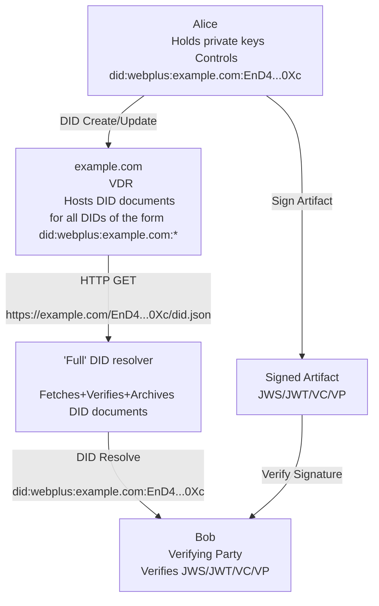

Note that the DID in the above diagram has been abbreviated so it will fit neatly.  The DID actually has the form:

    did:webplus:example.com:EnD4KcLMLmGSjEliVPgBdMsEC2B_brlSXPV2pu7W90Xc

and during DID resolution would translate to URL

    https://example.com/EnD4KcLMLmGSjEliVPgBdMsEC2B_brlSXPV2pu7W90Xc/did.json

In this scenario, the Verifying Party (Bob) runs a "Full" DID Resolver that handles all the fetching, verifying, and archival of DID documents, according to the `did:webplus` data model.  Resolving the same DID document can happen offline because it is already present in the archive.  DID updates are processed incrementally by the full DID resolver.

The VDR in `did:webplus` is performing the same function as that in `did:web`.  It SHOULD verify all DID documents posted to it by DID controllers.  However, even if the VDR doesn't perform its own verification and it serves an invalid DID document to the Full DID resolver, the Full DID resolver will detect the invalidity of the fetched DID document and return an appropriate error.

This "most basic" form of architecture is appropriate to use in scenarios such as:
-   Intra-organization operations in which organization participants can rely on the VDR remaining in service.
-   Use cases where it's not necessary to depend on long-term archival of DID documents by a third party that is neutral with respect to the VDR.
-   Use cases that will not involve legal disputes over signed artifacts.

Scenarios not handled by the "most basic" form of architecture can be handled by one of the following, higher forms of architecture.

### Intermediate `did:webplus` Architecture

The intermediate architecture for `did:webplus` adds a Verifiable Data Gateway (VDG) service, which allows for the existence of a "Thin" DID resolver.  This architecture is given by the following diagram.

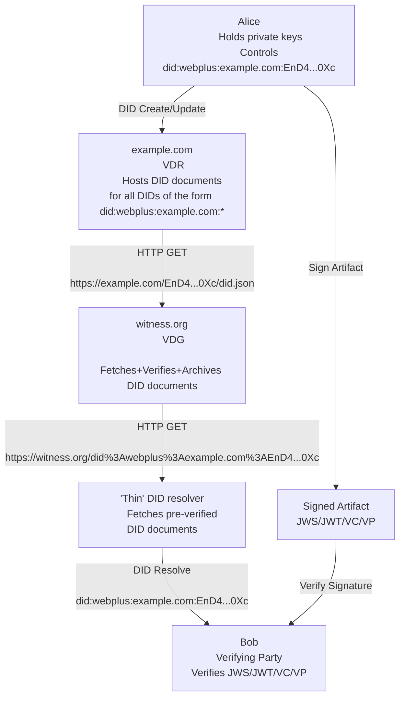

VDG stands for Verifiable Data Gateway, and is a web service that provides several crucial features of `did:webplus`, described in detail [here](#verifiable-data-gateway).

Note that use of a VDG doesn't prevent use of a Full DID resolver.  The Full DID resolver can be configured to fetch DID documents from a VDG.  This fact is also described in detail [here](#verifiable-data-gateway).

The intermediate architecture is appropriate to use in scenarios such as:
-   Within a consortium of organizations who will share a VDG to provide witnessing and archival services.
-   Use cases where historical DID resolution is needed for audit purposes.
-   Some use cases that may involve legal disputes over signed artifacts.

### Advanced `did:webplus` Architecture

The advanced architecture for `did:webplus` uses a cluster of VDGs (instead of a single one) and adds a Content Delivery Network (CDN), enabling a hyper-scaled VDG service delivering with lower latency.  This architecture is given by the following diagram.

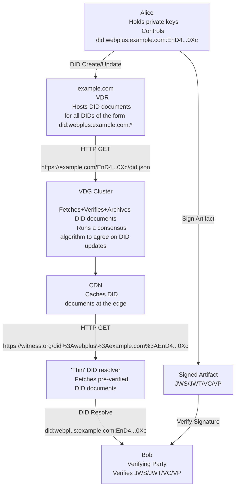

TODO: More detail on the cluster of VDGs and the consensus algorithm.

### DID Controller

A/the [DID controller](https://www.w3.org/TR/did-1.0/#dfn-did-controllers) is an entity capable of making valid changes to a DID document.  A DID might have more than one controller (e.g. Alice's laptop and Alice's smartphone, or Bob's smartphone and Charlie's smartphone).  For `did:webplus`, a/the controller is defined by the keys that are authorized to update the DID.  In particular, these are the keys listed in the `capabilityInvocation` verification relationship in the DID document.  Concretely, for a DID update to be valid, the new DID document must be validly self-signed, and the `selfSignatureVerifier` field must correspond to one of the keys listed in the latest existing DID document's `capabilityInvocation` field.

Here are the actions that a DID controller can take:

#### DID Create

A soon-to-be DID controller can create a DID by forming an un-signed, un-self-hashed root DID document that includes the desired components of the DID (VDR domain, port, and path components) and the controller's public keys, [self-signing](#self-signing) and [self-hashing](#self-hashed-data) the DID document, and then `HTTP POST`-ing the DID document to the resolution URL for the DID.

The DID document has several [self-hash slots](#self-hash-slots), notably including the suffix of the DID.  This construction is what cryptographically commits the DID to the content of its root DID document.

#### DID Update

A DID controller can update a DID by forming an updated DID document with appropriate relationships to the previous DID document and appropriate public keys, [self-signing](#self-signing) and [self-hashing](#self-hashed-data) the DID document, and then `HTTP PUT`-ing the DID document to the resolution URL for the DID.

#### Digitally Sign using Controlled DID

When a DID controller digitally signs an artifact, it uses a private key corresponding to one of its public keys, and includes in the artifact the fully qualified DID resource of the key used to sign.  This establishes:
-   The identity of the signer (the DID controller).
-   The specific key that can be used to verify the artifact.
-   The `selfHash` and `versionId` of the DID document that was current at the time of signing.

An example of a fully qualified DID resource is

    did:webplus:example.com:EjXivDidxAi2kETdFw1o36-jZUkYkxg0ayMhSBjODAgQ?selfHash=EgqvDOcj4HItWDVij-yHj0GtBPnEofatHT2xuoVD7tMY&versionId=1#DDG7RxmBBNf9HaTpr75uSDNS5qpHVOG2WEjmf7T7wi-I

This is "fully qualified" in that it defines the specific DID, specific DID document, and specific key.

### Verifying Party

A Verifying Party can verify a digitally signed artifact by resolving the DID of the signer to obtain and use the appropriate public key for signature verification.

A Verifying Party will use a DID Resolver to resolve the DID.  They may use a [Full DID Resolver](#full-did-resolver) or a [Thin DID Resolver](#thin-did-resolver), depending on their needs.

### Verifiable Data Registry

A Verifiable Data Registry (VDR) is a web service that serves the DID documents for DIDs associated with its domain.  This is a concept inherited from `did:web`.  The VDR is the origin for the DID documents for a given DID.  However, a DID's controller is the author of its DID documents.  As mentioned before, there is no verification of DID documents in the `did:web` method, and part of what `did:webplus` adds is a mechanism for cryptographically verifying DID documents.

The scale and scope of a VDR ranges anywhere from a person's self-hosted website hosting one or more DIDs to a hyper-scaled web service hosting millions of DIDs (e.g. on the scale of gmail.com).

Here are the operations provided by a VDR:

#### DID Create

From the perspective of the VDR, DID creation is simply a matter of verifying and storing a DID document `HTTP POST`-ed to the appropriate endpoint.  In addition to the generic DID document verification, the VDR MUST validate that the DID's domain, optional port, and path are all consistent with the VDR's service domain, port, and path.

To illustrate the DID creation process as a whole, say that Alice wants to create a DID.  Alice creates the root DID document, signs and self-hashes it, and then `HTTP POST`-s it to the resolution URL for the DID.  Note that the DID itself, which contains the self-hash of the root DID document, is derived during the creation process, and not determined by the VDR, but by Alice before the HTTP POST operation.

The following diagram illustrates the process.

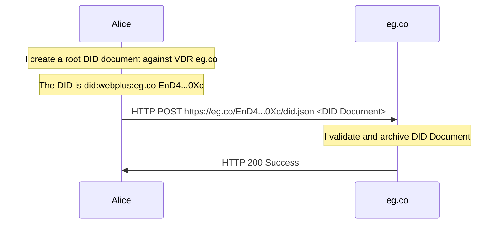

TODO: Specification for the HTTP API endpoint for DID creation.

#### DID Update

Like DID creation, from the perspective of the VDR, DID update is simply a matter of verifying and storing a DID document `HTTP PUT`-ed to the appropriate endpoint.  Because the new DID document is a non-root DID document, the verification includes verifying the relationship between the new DID document and the previous DID document, which MUST be present on the VDR and be valid.  In addition to the generic DID document verification, the VDR MUST validate that the DID's domain, optional port, and path are all consistent with the VDR's service domain, port, and path.

Alice updates her DID:


TODO: Specification for the HTTP API endpoint for DID update.

#### DID Resolve

The DID resolution process is intended to be used by a Verifying Party to obtain a specific version of a DID document for a given DID.  The DID document contains the public keys of the DID controller, and is used to verify signatures on artifacts signed by the DID controller.

From the perspective of the VDR, DID resolution is simply a matter of serving the appropriate DID document at the appropriate URL.

The DID documents comprising a DID's microledger map onto a file hierarchy so that all versions of a DID document are individually addressable.  Resolving the latest version of a DID document is done exactly as in `did:web`.

If the DID is `did:webplus:example.com:EjXivDidxAi2kETdFw1o36-jZUkYkxg0ayMhSBjODAgQ` then the DID resolution URL is `https://example.com/EjXivDidxAi2kETdFw1o36-jZUkYkxg0ayMhSBjODAgQ/did.json`.

Specific versions of the DID document are addressable by `versionId` or `selfHash` query parameters:
-   To resolve the DID document with `selfHash` value `EgqvDOcj4HItWDVij-yHj0GtBPnEofatHT2xuoVD7tMY`, the URL is `https://example.com/EjXivDidxAi2kETdFw1o36-jZUkYkxg0ayMhSBjODAgQ/did/selfHash/EgqvDOcj4HItWDVij-yHj0GtBPnEofatHT2xuoVD7tMY.json`
-   To resolve the DID document with `versionId` value `1`, the URL is `https://example.com/EjXivDidxAi2kETdFw1o36-jZUkYkxg0ayMhSBjODAgQ/did/versionId/1.json`

To illustrate, Bob resolves a DID to obtain the latest version of its DID document.  This is done simply via HTTP GET to the [resolution URL for the DID](TODO-link-me), and is precisely analogous to the process for `did:web`.

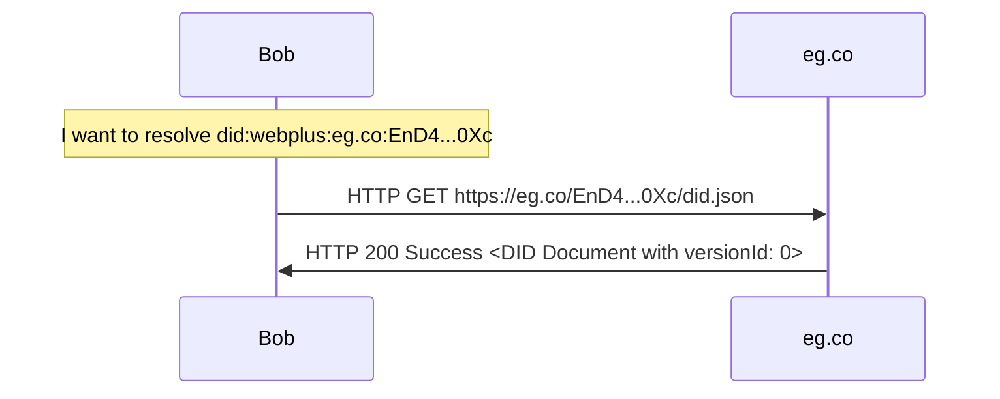

Bob resolves a specific DID document by `selfHash`:

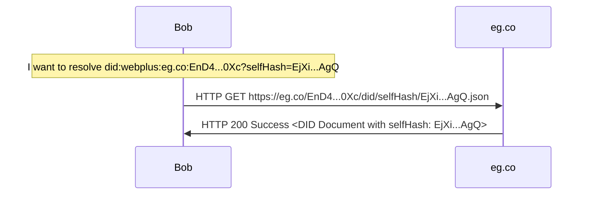

Bob resolves a specific DID document by `versionId`:

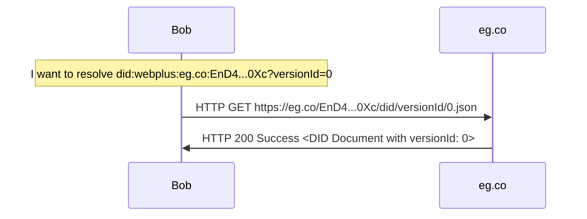

TODO: Specification for the HTTP API endpoint for DID resolution.

TODO: DID document metadata

### Verifiable Data Gateway

The Verifiable Data Gateway (VDG) is a large-scale web service that provides several crucial features of `did:webplus`, which are detailed in this section, but can be summarized as follows.
-   [What Does a VDG Do?](#what-does-a-vdg-do)
-   [A VDG provides a scope of agreement](#a-vdg-provides-a-scope-of-agreement) for clients of the VDG.
-   [A VDG allows for the existence of a "Thin" DID Resolver](#a-vdg-allows-for-a-thin-did-resolver).
-   [A VDG can pre-fetch+verify+archive DID documents](#pre-emptive-did-fetching-and-verification) upon VDR's DID update in some cases.
-   A VDG can service DID resolution requests in constant time, if the resolved DID document is already present in the VDG.
-   A VDG is web-cache-friendly, and can employ a CDN to:
    -   reduce load on the VDG service,
    -   provide additional security (e.g. mitigating DoS attacks), and
    -   provide extremely low-latency DID resolution via web caching at the edge.

First, some important concepts must be articulated.

#### Scope of Agreement for DID Documents

TODO: Maybe move parts of this into the `did:webplus` Data Model section.

Each Full DID resolver has its own verified model of the world (meaning the full histories of all DIDs it has ever resolved).  If there's no need to interact with the world model of other Full DID resolvers (meaning the full histories of all DIDs the others have ever resolved), then there is no need for anything further, and the "most basic" architecture of `did:webplus` suffices.

A problem arises when the interaction expands to include multiple verifying parties for a given DID.  The obviously correct and desired scenario is one in which all verifying parties agree on the full history of the given DID.  If verifying parties disagree on any part of the history of any specific DID, they do not reside within a "scope of agreement".  This condition is known as a [DID fork](#did-fork) and, if detected, MUST be considered a kind of fraud and MUST result in the offending DID being considered invalid[^].

##### One-to-One Relationship

In ["most basic" `did:webplus` architecture](#most-basic-didwebplus-architecture), DID documents are authored by DID Controllers, DID documents are served by VDRs, and DID documents are fetched, verified, and archived by Full DID resolvers.

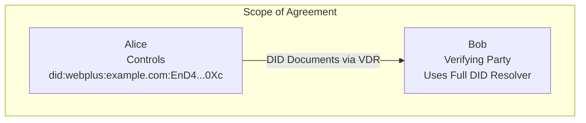

This describes a purely one-to-one relationship between Alice and Bob, who both reside within a "scope of agreement".  This scenario is already achieved by the "most basic" architecture.

##### DID Fork

A DID fork is where a malicious DID controller authors two (or more) differing yet valid histories, assigning one to each of the targeted verifying and with the collusion of the VDR[^malicious-vdr], one history is served to each of the targeted verifying parties[^serve-differing-histories], all for the purpose of defrauding those verifying parties, for example signature repudiation, e.g. in a legal dispute.

In this scenario, each of the targeted verifying parties fetch, verify, and archive DID documents successfully, and from their solitary perspectives, everything appears valid, and they carry on with their normal business.  If the verifying parties "compared notes"[^compare-notes], they would readily detect the DID fork, and SHOULD take action against the DID controller.

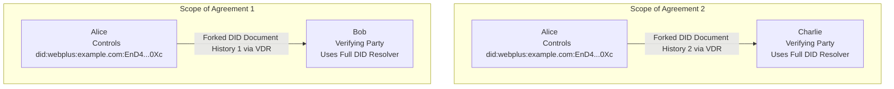

In order for the DID fork to originate from the same `did:webplus` DID, it must have the same root DID document (because this is what determines the root self-hash that comprises the suffix of the DID), and the differing histories are forked at a later version, as in the following diagram.  Note the differing `selfHash` field values in the forked DID documents of corresponding versions.

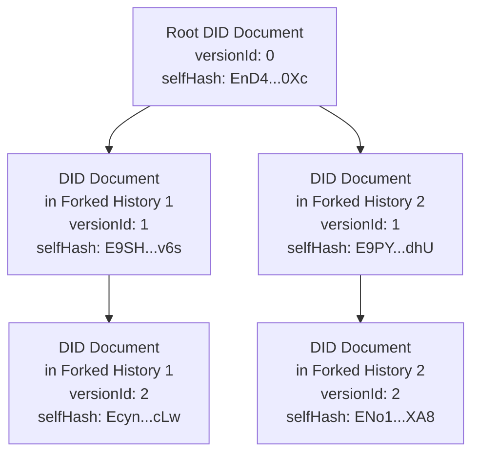

However, verifying parties aren't necessarily even aware of each other, let alone able to communicate with each other in order to ensure detection of DID forks.  While in principle a DID fork could be uncovered later during an audit or other legal process, the damage may have long since been done.

Thus detecting DID forks as early as possible is an important security mechanism for `did:webplus`.  This motivates, as will be described soon, the use of a VDG.

- TODO: Potential Recommendation: Credentials (e.g. [W3C Verifiable Credentials](https://www.w3.org/TR/vc-data-model/)) issued to a `did:webplus` DID may?/should?/must? represent the DID in its fully-qualified form, meaning with query params `selfHash` and `versionId` set to those of the DID document current at time of issuance.  This way, the credential itself contains a commitment to a particular DID history, and provides a foothold for detecting DID forks without adding any additional a-priori communication.  If a verifying party suspects a DID fork due to a mismatch between its own verified copy of the DID history and that committed to by the credential subject's "id" field, this does not by itself prove that the DID was forked.  The credential issuer would need to provide its verified copy of the DID history, and the discrepancy positively identified.

[^malicious-vdr]: This is an achievable scenario given how easy it is to run one's own VDR.
[^serve-differing-histories]: This would require detecting who is requesting DID documents, e.g. via IP address, and serving the DID document(s) from the assigned, forked history to them.
[^compare-notes]: The verifying parties could "compare notes" by comparing the `selfHash` fields from each DID document version they each hold.  If the `selfHash` fields differ, yet come from self-consistent histories, then those verifying parties have detected a DID fork.

##### DID Deletion/Alteration

Another category of fraud is the erasure or alteration of existing DID document(s).  Again, this would require a malicious DID controller to collude with a malicious VDR to delete or alter one or more DID documents to effectively erase or rewrite a portion of the DID's history.

This kind of fraud would be used in signature repudiation -- a DID controller legally disputing that they signed a particular artifact, perhaps because they want to get out of a contract with a counterparty to buy or sell something.

If the counterparty in this fraud scenario uses a Full DID resolver, then they have a copy of the verified DID history at the time of contract signing, and can use this in the legal dispute to prove that the DID controller did indeed produce the disputed signature.

However, if the verified history of the DID at the time of contracting signing is not available for the legal process, then the signature can be plausibly repudiated, because it can't be verifiably linked to the root DID document.  This motivates the use of a Full DID Resolver, and as will be described soon, the use of a VDG.

#### What Does a VDG Do?

The basic function of a Verifiable Data Gateway is in essence to be a Full DID Resolver that runs as a large-scale web service.  To reiterate what that means, the VDG fetches, verifies, archives, and resolves DID documents on behalf of its many users.  Because it archives previously fetched and verified DID documents, in many cases (e.g. resolving a DID document with a specific versionId or selfHash) it can resolve the DID in constant time.

DID resolution via VDG is illustrated in the following sequence diagram.  Bob is a verifying party who uses a VDG for DID resolution.  `eg.co` is a VDR hosted at that domain.  Bob wants to resolve the DID `did:webplus:eg.co:EnD4...0Xc`, and say the most recent DID document on `eg.co` for that DID has `versionId: 1`.

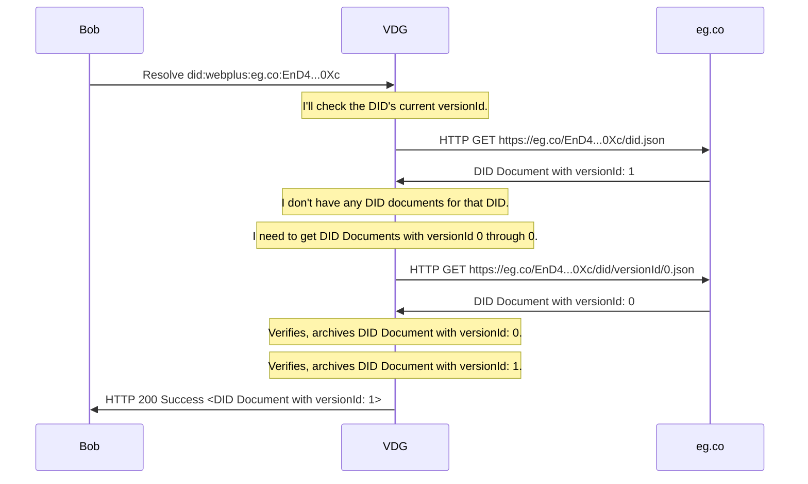

If Bob resolves the same DID, then the sequence diagram is as follows:

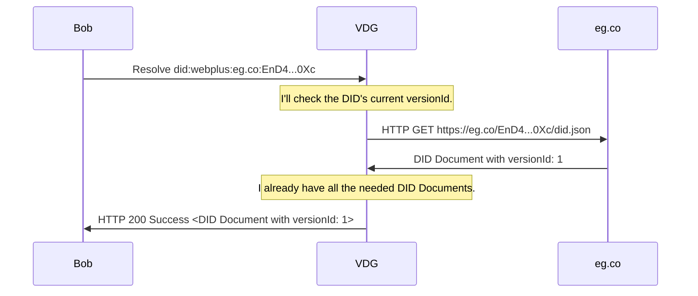

If Bob were to resolve a DID with specific query parameters, such as `versionId=1`, then the VDG could return it immediately.

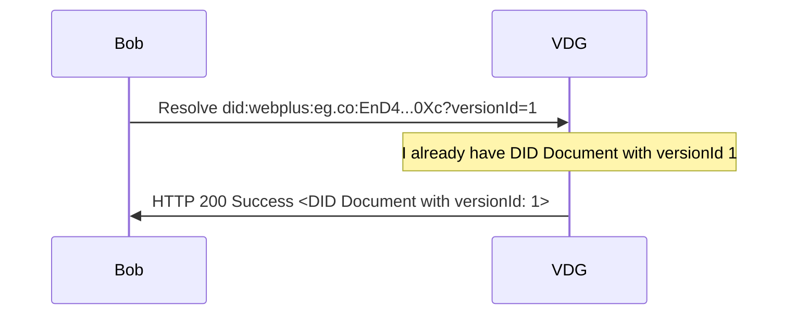

Say that Alice, who is the controller of `did:webplus:eg.co:EnD4...0Xc`, updates the DID (see [VDR](#verifiable-data-registry)):

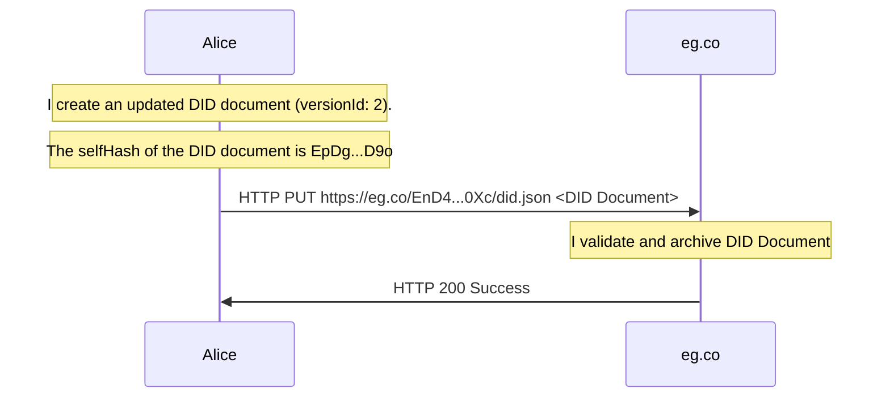

Now Bob resolves the DID again, without query parameters, in order to get the currently active DID document.

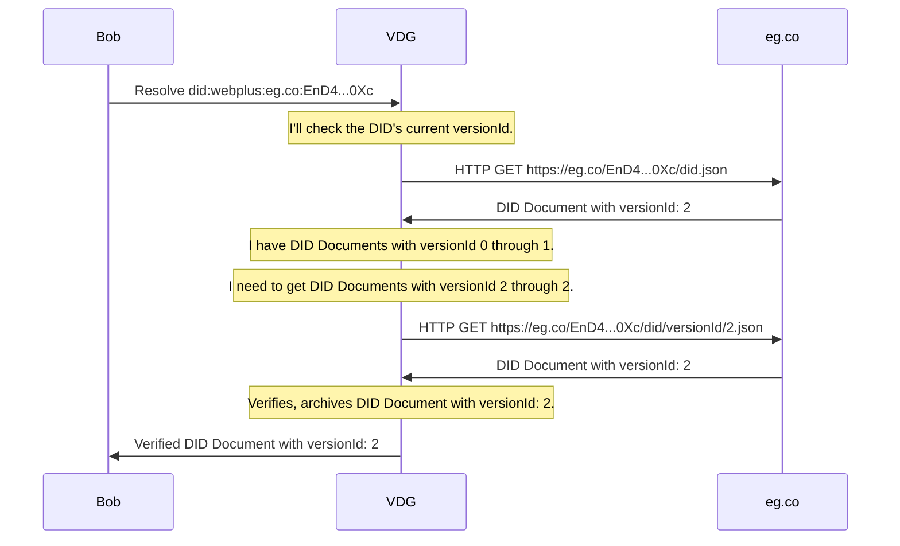

The use of a VDG provides other important qualitative and quantitative features, which will now be described in detail.

#### A VDG Provides a Scope of Agreement

One of the primary purposes of a VDG is that it can provides a shared scope of agreement across multiple verifying parties.  Parties can choose to trust a particular VDG.  All parties that trust the same VDG will exist within the same scope of agreement, which is defined as the DID histories fetched, verified, archived, and resolved by that VDG.

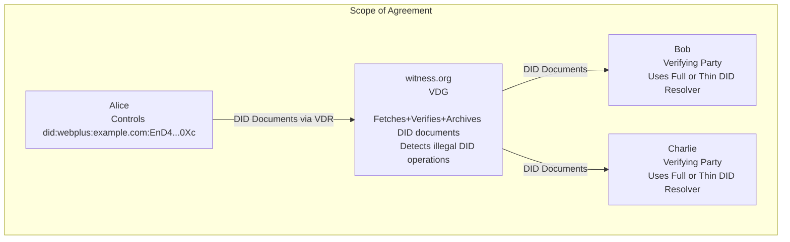

Note that there's nothing preventing multiple VDGs from operating over different sets of DIDs (overlapping or not).  Each of these VDGs defines its own scope of agreement, and these will only coincide if the VDGs operate on the same set of DIDs.

An example of two non-overlapping scopes of agreement corresponding to two VDGs:

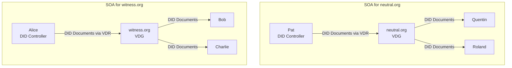

Another diagram could show a partial overlap between two scopes of agreement, and is left as an exercise for the reader.

#### A VDG Allows for a Thin DID Resolver

The presence of a VDG allows for the existence of the "Thin" DID resolver, which is configured to use a trusted VDG to perform fetching, verification, and archival on behalf of the Thin DID resolver.

The Thin DID resolver is equivalent in complexity to the `did:web` DID resolver -- it only must issue a HTTP GET operation to an appropriate URL in order to fetch the appropriate DID document.  However, DID document fetched from the trusted VDG has already been verified, so no further verification is needed on the part of the Thin DID resolver.  This makes the Thin DID resolver browser-friendly -- an important adoption criteria.

#### Pre-emptive DID Fetching and Verification

VDRs can be configured to pre-emptively push DID updates to specific VDGs.  This is illustrated in the following diagram.  Alice controls `did:webplus:eg.co:EnD4...0Xc` and updates her DID (see [VDR](#verifiable-data-registry)).  Let's say that the VDG is running at `witness.org`.

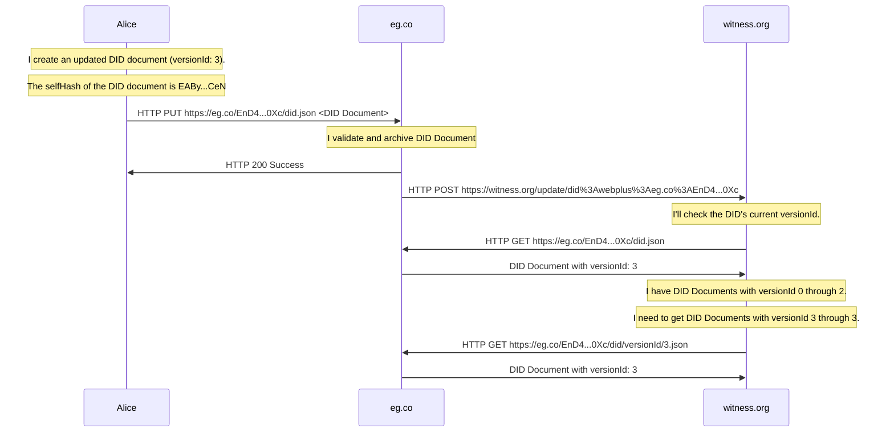

Now, if Bob resolves the DID, it can be returned in constant time.

```mermaid
sequenceDiagram
    Bob->>VDG: Resolve did:webplus:eg.co:EnD4...0Xc
    Note over VDG: I'll check the DID's current versionId.
    VDG->>eg.co: HTTP GET https://eg.co/EnD4...0Xc/did.json
    eg.co->>VDG: DID Document with versionId: 3
    Note over VDG: I already have all the needed DID Documents.
    VDG->>Bob: HTTP 200 Success <DID Document with versionId: 3>
```

Better though, in practice, signatures should include the selfHash and versionId parameters in the key identifier field, which plays a twofold role:
-   It is a limited form of witnessing, wherein the signer is committing to a particular DID history in an artifact received by outside parties.
-   It makes the DID resolution specific and require fewer steps.
-   In the case where the verifying party is using a local Full DID resolver, any repeat DID resolutions can happen entirely offline, and therefore with very low latency!

[As shown previously](#what-does-a-vdg-do), if Bob were to resolve a DID with specific query parameters, such as `versionId=3`, then the VDG could return it immediately without needing to query the VDR for the current DID document.

```mermaid
sequenceDiagram
    Bob->>VDG: Resolve did:webplus:eg.co:EnD4...0Xc?versionId=3
    Note over VDG: I already have DID Document with versionId 3
    VDG->>Bob: HTTP 200 Success <DID Document with versionId: 3>
```

### DID Resolver

A DID resolver is what translates a DID into a DID document through a "resolution" process.  Like `did:web`, this involves translating the DID into a specific URL (or set of URLs) that can be used to fetch the DID document(s).  The domain component of the DID is what defines which VDR is responsible for hosting and serving the DID's DID documents.

However, `did:webplus` includes specific filesystem mapping rules for DID query parameters:
-   `versionId` -> `.../did/versionId/<versionId>.json` for example:

        did:webplus:example.com:EjXivDidxAi2kETdFw1o36-jZUkYkxg0ayMhSBjODAgQ?versionId=1 -> https://example.com/EjXivDidxAi2kETdFw1o36-jZUkYkxg0ayMhSBjODAgQ/did/versionId/1.json

-   `selfHash` -> `.../did/selfHash/<selfHash>.json` for example:

        did:webplus:example.com:EjXivDidxAi2kETdFw1o36-jZUkYkxg0ayMhSBjODAgQ?selfHash=EgqvDOcj4HItWDVij-yHj0GtBPnEofatHT2xuoVD7tMY -> https://example.com/EjXivDidxAi2kETdFw1o36-jZUkYkxg0ayMhSBjODAgQ/did/selfHash/EgqvDOcj4HItWDVij-yHj0GtBPnEofatHT2xuoVD7tMY.json

This gives each DID document a unique URL, which can be used to fetch the DID document directly.

Using a filesystem mapping instead of query parameters in the resolution URL allows for static-content servers that don't support query parameters to act as VDRs, such as [GitHub Pages](https://pages.github.com/).  This capability is important for decentralization and self-sovereignty.

There are two kinds of `did:webplus` DID resolver: "full" and "thin".  Each have different capabilities and intended uses.

#### Full DID Resolver

The "Full" DID Resolver keeps its own copy of the microledger for each DID it resolves.  This provides a few crucial capabilities:
-   It can detect DID forks and alterations.
-   It can perform historical DID resolution, thereby allowing verification of historical signed artifacts.
-   In many cases, DID resolution can happen entirely offline, providing very low latency.

#### Thin DID Resolver

TODO: Describe how the Thin DID Resolver uses a VDG to resolve a DID.

#### DID Resolver Operations

##### Resolve Latest DID Document

Resolving a DID without query parameters should return that DID's latest DID document.  In order to determine the latest DID document, the resolver MUST query the VDR whose domain  hosting the DID's microledger, which is the origin for that DID's microledger, and therefore the authority on which DID document is the latest.

The DID-to-resolution-URL translation rules for the latest DID document are the same as those for `did:web`, for example:

    did:webplus:example.com:EjXivDidxAi2kETdFw1o36-jZUkYkxg0ayMhSBjODAgQ -> https://example.com/EjXivDidxAi2kETdFw1o36-jZUkYkxg0ayMhSBjODAgQ/did.json
    did:webplus:example.com:path-component:EjXivDidxAi2kETdFw1o36-jZUkYkxg0ayMhSBjODAgQ -> https://example.com/path-component/EjXivDidxAi2kETdFw1o36-jZUkYkxg0ayMhSBjODAgQ/did.json
    did:webplus:example.com%3A3000:EjXivDidxAi2kETdFw1o36-jZUkYkxg0ayMhSBjODAgQ -> https://example.com:3000/EjXivDidxAi2kETdFw1o36-jZUkYkxg0ayMhSBjODAgQ/did.json
    did:webplus:example.com%3A3000:path-component:EjXivDidxAi2kETdFw1o36-jZUkYkxg0ayMhSBjODAgQ -> https://example.com:3000/path-component/EjXivDidxAi2kETdFw1o36-jZUkYkxg0ayMhSBjODAgQ/did.json

    did:webplus:localhost:EjXivDidxAi2kETdFw1o36-jZUkYkxg0ayMhSBjODAgQ -> http://localhost/EjXivDidxAi2kETdFw1o36-jZUkYkxg0ayMhSBjODAgQ/did.json
    did:webplus:localhost:path-component:EjXivDidxAi2kETdFw1o36-jZUkYkxg0ayMhSBjODAgQ -> http://localhost/path-component/EjXivDidxAi2kETdFw1o36-jZUkYkxg0ayMhSBjODAgQ/did.json
    did:webplus:localhost%3A3000:EjXivDidxAi2kETdFw1o36-jZUkYkxg0ayMhSBjODAgQ -> http://localhost:3000/EjXivDidxAi2kETdFw1o36-jZUkYkxg0ayMhSBjODAgQ/did.json
    did:webplus:localhost%3A3000:path-component:EjXivDidxAi2kETdFw1o36-jZUkYkxg0ayMhSBjODAgQ -> http://localhost:3000/path-component/EjXivDidxAi2kETdFw1o36-jZUkYkxg0ayMhSBjODAgQ/did.json

The resolver MUST use HTTPS when resolving a DID for which the VDR is not `localhost`.

##### Resolve DID Document with Query Parameters

Resolving a DID document with query parameters should return the DID document at the specified `versionId` or `selfHash`.

TODO

### DID Document Store

The unit of data in `did:webplus` is the DID Document, from which the rest of the data model is derived (e.g. DID document metadata, the microledger).  DID documents contain their own identifiers in the form of their `selfHash` field, and they link to their predecessors via the `prevDIDDocumentSelfHash` field.  The DID Document Store is what provides the basic logic behind the `did:webplus` data model -- verifying, archiving, and performing queries on `did:webplus` DID documents.

Many components of `did:webplus` use a DID document store in some form in order to function:
-   DID controller: Keeps its own copy of the controlled DID's microledger -- the entire history of DID documents.
-   VDR: Keeps a copy of the microledger for each DID it serves.
-   VDG: Keeps a copy of the microledger for each DID it witnesses and serves.
-   Full DID resolver: Keeps a copy of the microledger for each DID it resolves, so that:
    -   It can keep its own copy of the microledger for historical DID document resolution and audit.
    -   It can service some DID resolution requests fully offline.

Notably, the Thin DID resolver does not use a DID document store.  Instead, it outsources that functionality to the VDG.

## `did:webplus` Data Model

Recall that a DID is an identifier that, through the DID resolution process, can be used to obtain the DID controller's public keys.  This is the primary mechanism by which a Verifying Party can verify signatures on artifacts signed by the DID controller.

The indirection of using a DID instead of the public keys directly is that it makes key rotation possible without breaking existing verification relationships (e.g. credentials issued by or to a DID).  

Besides the DID itself, the primary piece of data is the DID document.  A DID document is a JSON object that contains the public keys of the DID controller (and can potentially include other things).  The content of the DID document can be changed over time, and a central feature of `did:webplus` is that the entire, versioned history of DID documents is available and can be cryptographically verified.

### DID Microledger

The cryptographically verifiable history of a DID is called its "microledger".  The microledger is a sequence of DID documents, each of which are linked to the previous in a cryptographically verifiable way.  The first DID document has no predecessor, and is called the "root" DID document.

```mermaid
graph TD
    DID[
        did:webplus:example.com:EnD4...0Xc
    ]
    DID --> LatestDIDDocument
    subgraph DIDDocuments
        direction TB
        LatestDIDDocument[
            Latest DID Document
            versionId: 3
        ] --> DIDDocument2
        DIDDocument2[
            DID Document
            versionId: 2
        ] --> DIDDocument1
        DIDDocument1[
            DID Document
            versionId: 1
        ] --> DIDDocument0
        DIDDocument0[
            Root DID Document
            versionId: 0
        ]
    end
```

TODO: Move this to a "more detail" section.

```mermaid
graph TD
    DID[
        did:webplus:example.com:EnD4...0Xc
    ]
    DID --> LatestDIDDocument
    subgraph DIDDocuments
        direction TB
        LatestDIDDocument[
            Latest DID Document
            versionId: 3
            selfHash: E7e1...sQ2
            prevDIDDocumentSelfHash: EQ80...gG5
        ] --> DIDDocument2
        DIDDocument2[
            DID Document
            versionId: 2
            selfHash: EQ80...gG5
            prevDIDDocumentSelfHash: Ea54...2Fm
        ] --> DIDDocument1
        DIDDocument1[
            DID Document
            versionId: 1
            selfHash: Ea54...2Fm
            prevDIDDocumentSelfHash: EnD4...0Xc
        ] --> DIDDocument0
        DIDDocument0[
            Root DID Document
            versionId: 0
            selfHash: EnD4...0Xc
            prevDIDDocumentSelfHash: null
        ]
    end
```

### DID Document

In `did:webplus`, the DID document is represented directly as a JSON object that conforms to the following data model.  It is meant to conform to the [DID spec](https://www.w3.org/TR/did-1.1/).  In addition, it has several fields that are specific to `did:webplus`.

#### DID Document Data Model

-   `id`: MUST be a valid `did:webplus` DID with no query parameters or fragment.
-   `selfHash`: MUST be a valid self-hash in the [KERI hash encoding](TODO-link-me-to-appropriate-section).  See [self-hashing](#self-hashing) for specifics on the self-hash generation and verification process.
-   `selfSignature`: MUST be a valid self-signature in the [KERI signature encoding](TODO-link-me-to-appropriate-section).  See [self-signing](#self-signing) for specific relationships between `selfSignature`, `selfSignatureVerifier`, and root and/or previous DID documents.
-   `selfSignatureVerifier`: MUST be a valid public key in the [KERI verifier encoding](TODO-link-me-to-appropriate-section).
-   `prevDIDDocumentSelfHash`: MUST be `null` or a valid self-hash in the [KERI hash encoding](TODO-link-me-to-appropriate-section).
-   `validFrom`: MUST be a valid [RFC 3339](https://www.rfc-editor.org/rfc/rfc3339) timestamp.
-   `versionId`: MUST be an unsigned integer.
-   `verificationMethod`: MUST be an array of [verification methods](TODO-link-me-to-appropriate-section), each of whose key id (the fragment identifying the specific key) MUST be equal to the KERI-encoding of the key.  This achieves two things:
    -   It allows for the key to have a canonical key id.
    -   It allows for the public key to be read out of a DID resource URI so that use of the public key can be done in parallel with the DID resolution process.  The DID resolution process MUST also be performed in order to establish that the identified key is indeed allowed for the relevant key purpose (authentication, assertionMethod, etc).
-   Fields for [Verification Relationships](https://www.w3.org/TR/did-1.1/#verification-relationships)
    -   [`authentication`](https://www.w3.org/TR/did-1.1/#authentication)
    -   [`assertionMethod`](https://www.w3.org/TR/did-1.1/#assertion)
    -   [`keyAgreement`](https://www.w3.org/TR/did-1.1/#key-agreement)
    -   [`capabilityInvocation`](https://www.w3.org/TR/did-1.1/#capability-invocation)
    -   [`capabilityDelegation`](https://www.w3.org/TR/did-1.1/#capability-delegation)

NOTE: The use of KERI-encoded data (e.g. public keys, hashes, signatures) is likely to be changed in the future to use multiformat-based encoding, as it is more standardized, supports more hash/key/signature types, and is more broadly supported.

There are additional constraints that depend on if a DID document is a root DID document or a non-root DID document.

#### Root DID Document

A root DID document is the first DID document in a DID's microledger.  It has the following additional constraints:
-   `prevDIDDocumentSelfHash` MUST be `null`.
-   `selfSignatureVerifier` MUST correspond to a key in the `capabilityInvocation` array in this same DID document.
-   `versionId` MUST be 0.

NOTE: The specific relationship of selfSignatureVerifier to the `capabilityInvocation` array is likely to be changed in the future in order to decouple the generic DID document data model from the signing scheme.

#### Non-Root DID Documents

A non-root DID document is any DID document that is not a root DID document.  It has the following additional constraints:
-   `prevDIDDocumentSelfHash` MUST be the `selfHash` of the previous DID document.
-   `selfSignatureVerifier` MUST correspond to a key in the `capabilityInvocation` array in the previous DID document.
-   `validFrom` MUST be later than the `validFrom` of the previous DID document.
-   `versionId` MUST be exactly one greater than the `versionId` of the previous DID document.

#### Example DID Documents

Here is an example of the first two DID documents in the microledger for a DID.

Root DID document (`versionId` 0):

```json
{
  "id": "did:webplus:example.com:EjXivDidxAi2kETdFw1o36-jZUkYkxg0ayMhSBjODAgQ",
  "selfHash": "EjXivDidxAi2kETdFw1o36-jZUkYkxg0ayMhSBjODAgQ",
  "selfSignature": "0BuQYSLaLz_HBZulqOI_jH3T3BoKI_QZ9MHE58zzJKmT4M2FOMLW3OFCBJZ8k0jZaAY7YJzyk8finF1bICjXmUDQ",
  "selfSignatureVerifier": "Dar0F7zeNrtp2tGBplO2ZVCPyLHyxsWOAEv9i-5khnsE",
  "validFrom": "2023-09-29T10:01:29.860693793Z",
  "versionId": 0,
  "verificationMethod": [
    {
      "id": "did:webplus:example.com:EjXivDidxAi2kETdFw1o36-jZUkYkxg0ayMhSBjODAgQ#Dar0F7zeNrtp2tGBplO2ZVCPyLHyxsWOAEv9i-5khnsE",
      "type": "JsonWebKey2020",
      "controller": "did:webplus:example.com:EjXivDidxAi2kETdFw1o36-jZUkYkxg0ayMhSBjODAgQ",
      "publicKeyJwk": {
        "kid": "did:webplus:example.com:EjXivDidxAi2kETdFw1o36-jZUkYkxg0ayMhSBjODAgQ#Dar0F7zeNrtp2tGBplO2ZVCPyLHyxsWOAEv9i-5khnsE",
        "kty": "OKP",
        "crv": "ed25519",
        "x": "ar0F7zeNrtp2tGBplO2ZVCPyLHyxsWOAEv9i-5khnsE"
      }
    }
  ],
  "authentication": [
    "#Dar0F7zeNrtp2tGBplO2ZVCPyLHyxsWOAEv9i-5khnsE"
  ],
  "assertionMethod": [
    "#Dar0F7zeNrtp2tGBplO2ZVCPyLHyxsWOAEv9i-5khnsE"
  ],
  "keyAgreement": [
    "#Dar0F7zeNrtp2tGBplO2ZVCPyLHyxsWOAEv9i-5khnsE"
  ],
  "capabilityInvocation": [
    "#Dar0F7zeNrtp2tGBplO2ZVCPyLHyxsWOAEv9i-5khnsE"
  ],
  "capabilityDelegation": [
    "#Dar0F7zeNrtp2tGBplO2ZVCPyLHyxsWOAEv9i-5khnsE"
  ]
}
```

Note in particular that the `selfSignatureVerifier` field, `Dar0F7zeNrtp2tGBplO2ZVCPyLHyxsWOAEv9i` is also present in the `capabilityInvocation` array, formatted as a relative DID resource (i.e. a `#`-prefixed fragment).  This specific verification relationship is what defines the authorization rules for the root DID document.

NOTE: It's likely that the authorization rules will be decoupled from the DID document data model in the near future, meaning that `capabilityInvocation` will not be involved in the authorization rules, and instead a different field will be used.

DID Document with `versionId` 1

```json
{
  "id": "did:webplus:example.com:EjXivDidxAi2kETdFw1o36-jZUkYkxg0ayMhSBjODAgQ",
  "selfHash": "EgqvDOcj4HItWDVij-yHj0GtBPnEofatHT2xuoVD7tMY",
  "selfSignature": "0BECMc-xhI3T2eo0w2bSHT3Rr_hVV5Yt7S0ySzW4Rxxh15iR9ALvDUvXn7d7fB5cjT2f5ZROVcFmdj8NZ8snaXAw",
  "selfSignatureVerifier": "Dar0F7zeNrtp2tGBplO2ZVCPyLHyxsWOAEv9i-5khnsE",
  "prevDIDDocumentSelfHash": "EjXivDidxAi2kETdFw1o36-jZUkYkxg0ayMhSBjODAgQ",
  "validFrom": "2023-09-29T10:01:29.896537517Z",
  "versionId": 1,
  "verificationMethod": [
    {
      "id": "did:webplus:example.com:EjXivDidxAi2kETdFw1o36-jZUkYkxg0ayMhSBjODAgQ#DDG7RxmBBNf9HaTpr75uSDNS5qpHVOG2WEjmf7T7wi-I",
      "type": "JsonWebKey2020",
      "controller": "did:webplus:example.com:EjXivDidxAi2kETdFw1o36-jZUkYkxg0ayMhSBjODAgQ",
      "publicKeyJwk": {
        "kid": "did:webplus:example.com:EjXivDidxAi2kETdFw1o36-jZUkYkxg0ayMhSBjODAgQ#DDG7RxmBBNf9HaTpr75uSDNS5qpHVOG2WEjmf7T7wi-I",
        "kty": "OKP",
        "crv": "ed25519",
        "x": "DG7RxmBBNf9HaTpr75uSDNS5qpHVOG2WEjmf7T7wi-I"
      }
    },
    {
      "id": "did:webplus:example.com:EjXivDidxAi2kETdFw1o36-jZUkYkxg0ayMhSBjODAgQ#Dar0F7zeNrtp2tGBplO2ZVCPyLHyxsWOAEv9i-5khnsE",
      "type": "JsonWebKey2020",
      "controller": "did:webplus:example.com:EjXivDidxAi2kETdFw1o36-jZUkYkxg0ayMhSBjODAgQ",
      "publicKeyJwk": {
        "kid": "did:webplus:example.com:EjXivDidxAi2kETdFw1o36-jZUkYkxg0ayMhSBjODAgQ#Dar0F7zeNrtp2tGBplO2ZVCPyLHyxsWOAEv9i-5khnsE",
        "kty": "OKP",
        "crv": "ed25519",
        "x": "ar0F7zeNrtp2tGBplO2ZVCPyLHyxsWOAEv9i-5khnsE"
      }
    }
  ],
  "authentication": [
    "#Dar0F7zeNrtp2tGBplO2ZVCPyLHyxsWOAEv9i-5khnsE",
    "#DDG7RxmBBNf9HaTpr75uSDNS5qpHVOG2WEjmf7T7wi-I"
  ],
  "assertionMethod": [
    "#Dar0F7zeNrtp2tGBplO2ZVCPyLHyxsWOAEv9i-5khnsE"
  ],
  "keyAgreement": [
    "#Dar0F7zeNrtp2tGBplO2ZVCPyLHyxsWOAEv9i-5khnsE"
  ],
  "capabilityInvocation": [
    "#DDG7RxmBBNf9HaTpr75uSDNS5qpHVOG2WEjmf7T7wi-I"
  ],
  "capabilityDelegation": [
    "#Dar0F7zeNrtp2tGBplO2ZVCPyLHyxsWOAEv9i-5khnsE"
  ]
}
```

Note that in particular, the `selfSignatureVerifier` field, `Dar0F7zeNrtp2tGBplO2ZVCPyLHyxsWOAEv9i-5khnsE` is present in the `capabilityInvocation` array of the **previous** DID document, formatted as a relative DID resource (i.e. a `#`-prefixed fragment).  This specific verification relationship is what defines the authorization rules for non-root DID documents.  Each DID document specifies which keys are authorized to update the DID.  Note also that the `capabilityInvocation` field has changed relative to the previous DID document, meaning that the key has rotated and that the newly specified key, `DDG7RxmBBNf9HaTpr75uSDNS5qpHVOG2WEjmf7T7wi-I`, will need to be used for the next DID update.

### Addressability and Witnessing of DID Documents

TODO: Rework this section regarding witnessing (it doesn't actually provide any verifiable witnessing, only a way to make the resolution process faster).  The cryptographic commitment provided in a signature is only partial -- if the DID document resolves and verifies, then it has sped along the resolution process.  But if the DID document doesn't match, this doesn't prove anything about the DID controller, since an attacker could have created that signature with a forged fully-qualified key resource.

A crucial feature of `did:webplus` is that each DID document in a DID's entire history can be addressed by its `selfHash` or `versionId`.  This allows the DID resolution process to resolve a specific DID document.

"Witnessing" is the process of providing, to an external observer, a cryptographic commitment to some data.  In the case of `did:webplus`, the data being witnessed is a DID document.  The fact that a specific DID document can be addressed by its `selfHash` (which is a cryptographic commitment to the content of that DID document) provides an important form of witnessing:
-   A DID controller can sign an artifact and specify the signing key in "fully qualified" form, meaning that it includes, in the query parameters of the signature's key id, the `selfHash` and `versionId` of the DID document current at time of signing.  Using the DID documents in the [above example](#example-did-documents):
    -   If the root DID document (i.e. that with `versionId` 0) is current at time of signing, and the key being used is `#Dar0F7zeNrtp2tGBplO2ZVCPyLHyxsWOAEv9i-5khnsE`, then the key id of the signature is:

        ```
        did:webplus:example.com:EjXivDidxAi2kETdFw1o36-jZUkYkxg0ayMhSBjODAgQ?selfHash=EjXivDidxAi2kETdFw1o36-jZUkYkxg0ayMhSBjODAgQ&versionId=0#Dar0F7zeNrtp2tGBplO2ZVCPyLHyxsWOAEv9i-5khnsE
        ```

    -   If the DID document with `versionId` 1 is current at time of signing, and the key being used is `#DDG7RxmBBNf9HaTpr75uSDNS5qpHVOG2WEjmf7T7wi-I`, then the key id of the signature is:

        ```
        did:webplus:example.com:EjXivDidxAi2kETdFw1o36-jZUkYkxg0ayMhSBjODAgQ?selfHash=EgqvDOcj4HItWDVij-yHj0GtBPnEofatHT2xuoVD7tMY&versionId=1#DDG7RxmBBNf9HaTpr75uSDNS5qpHVOG2WEjmf7T7wi-I
        ```

-   When a Verifying Party verifies a signature that includes the fully-qualified key id, it can fetch and verify the addressed DID document directly, instead of having to fetch and verify all DID updates.  If the addressed DID document already exists in the Verifying Party's Full DID resolver's archive, then this DID resolution can happen fully offline, and therefore will be very fast.
-   When the signer commits to a specific DID document, it is committing to the entire history of the DID.  If the `selfHash` and `versionId` don't match those in the resolved DID document, then:
    -   The Verifying Party MUST consider the signature invalid.  The causes for this could be:
        -   An attacker has created a false signature and is attempting to forge a cryptographic commitment to a DID document.
        -   The DID controller has made a mistake in the signing process.
    -   The Verifying Party could consider reporting the incident to the DID controller, or to an appropriate third party.

### Summary

-   A DID's entire history is represented by its microledger -- the ordered sequence of its DID documents.
-   Each DID document is [self-hashed data](#self-hashed-data), meaning:
    -   It contains its own identifier (the self-hash value).
    -   The self-hash value is a cryptographically verifiable commitment to the content of the DID document.
-   The DID itself contains the self-hash of its root DID document, and is therefore cryptographically committed to the content of its root DID document.
-   Each non-root DID document links to its predecessor via the predecessor's self-hash.  This relationship is what defines the microledger.  Each non-root DID document is cryptographically committed to the content of its predecessor, and therefore of all predecessors, transitively.
-   Each DID document is [self-signed](#self-signing).
    -   In the case of the root DID document, the self-signing key corresponds to a particular key in its own `capabilityInvocation` array.
    -   In the case of non-root DID documents, the self-signing key corresponds to a particular key in the `capabilityInvocation` array of the previous DID document.
-   Each DID document has a `validFrom` timestamp, each each successor DID document has a `validFrom` timestamp that is later than the `validFrom` timestamp of the predecessor DID document.  This provides a well-defined validity duration for each DID document.
-   Each DID document has a `versionId` field, which is an unsigned integer.  Each successor DID document has a `versionId` field that is exactly one greater than the `versionId` field of the predecessor DID document, starting with 0 for the root DID document.  This provides a well-defined numbering of DID documents.

## Appendix

### Self-Hashed Data

#### Context

A cryptographic hash function computes a fixed-size "digest" of its input data that can be used as a powerful mechanism for distinguishing differing data.  The hash value of a piece of data is often used as a means for "content integrity protection" -- if even one bit of the input data is altered, the hash value will be different, and thus alterations in the input data are readily detectable.

Conventional content integrity protection operates by reporting the hash of a specific piece data in a side-channel, and then verifying that the computed hash of the data matches the reported hash value.  If these values don't match, then the data has been altered.  If these values match then practically speaking the data has [almost certainly not been altered](https://en.wikipedia.org/wiki/Collision_resistance).  In the case of a hash value mismatch, the alteration could have legitimate origins (a file was corrupted due to system fault), or could have malicious origins (an attacker trying to infiltrate data into a target system).

```mermaid
graph TD
    S[Source Data] -->|Compute Hash| H
    S --> O
    H[Hash of Data] --> O
    O[Source Data, Hash of Data]
```

In the conventional approach, the hash value of the data must be communicated in a side-channel, because any attempt to include the hash into the data will alter the data and thus change its hash value.

#### What Is Self-Hashed Data?

Self-hashed data is data which, under a specific definition, contains its own hash.  For the reason [described earlier](####context) this hash value can't be the convenientional hash value.  However, by altering the hash generation and verification process, a kind of self-hash can be defined.

##### Self-Hash Slots

Self-hashable data must have slightly more structure than the untyped byte stream that is consumed by convenientional hash functions.  In particular, self-hashable data must have a set of "self-hash slots" each of which are meant to be populated with the computed self-hash for the data.  What the self-hash slots are depends on semantic aspects of the data (i.e. which fields are considered to be self-hash slots).

Each self-hash slot is a pair (H, V), where
-   H represents the hash function being used and
-   V represents a value of the type output by H

##### Placeholders

Additionally, for each hash function H, there is a "placeholder" (H, P), where P is the "all zeros" value of the type output by H.

##### Encoding Used in `did:webplus`

In `did:webplus`, hashes are represented as ASCII strings as in [KERI](https://github.com/decentralized-identity/keri/blob/master/kids/kid0001.md#derivation-codes), where the first character gives the hash function and the remainder of the string is the base64url-encoding of the hash value.  In particular, the Blake3 hash function is represented using the character `E`, and the 256-bit hash value is represented as a 43-digit base64url-encoded string.  For example:

    EjXivDidxAi2kETdFw1o36-jZUkYkxg0ayMhSBjODAgQ

The placeholder value for the Blake3 hash function is

    EAAAAAAAAAAAAAAAAAAAAAAAAAAAAAAAAAAAAAAAAAAA

noting that 43 `A` characters is the base64url-encoding of 256 bits of 0.

Note however that `did:webplus`'s usage of the KERI-based encoding of hash values (and other categories of cryptographic data) will eventually transition to multiformat-based encoding.  The reason is because [multiformat](https://github.com/multiformats/multihash?tab=readme-ov-file) is more standardized and broadly supported, and [supports more hash functions](https://github.com/multiformats/multicodec/blob/master/table.csv).

##### Self-Hashed Data Generation

Abstractly, the process is:

```mermaid
graph TD
    S[Source Data] -->|Set Self-Hash Slots to Placeholder Value| P
    S --> O
    P[Data With Placeholders] -->|Canonicalize| C
    C[Canonicalized Data With Placeholders] -->|Compute Hash Conventionally| H
    H[Hash of: Canonicalized Data With Placeholders] --> O
    O{Set All Self-Hash Slots to Computed Hash} --> F
    F[Self-Hashed Data]
```

##### Self-Hashed Data Verification

Abstractly, the process is:

```mermaid
graph TD
    S[Unverified Self-Hashed Data] -->|Set Self-Hash Slots to Placeholder Value| P
    S --> O
    P[Data With Placeholders] -->|Canonicalize| C
    C[Canonicalized Data With Placeholders] -->|Compute Hash Conventionally| H
    H[Hash of: Canonicalized Data With Placeholders] --> O
    O{Are All Self-Hash Slots Equal to Computed Hash?}
    O -->|Yes| Success[Verification Succeeded]
    O -->|No| Failure[Verification Failed]
```

#### Concrete Example

For this example, let's use JSON as the data format, JSON Canonicalization Scheme (JCS), and KERI hashes.  Define the data to have two self-hash slots:
-   the entire `selfHash` field and
-   the path component of the URL in the `$id` field.

Note that in this specific case, a self-hash slot is only a portion of a given JSON object field.  This specific pattern is used when generating the DID in `did:webplus`.

```mermaid
graph TD
    S["`{
        #quot;foo#quot;:#quot;bar#quot;,
        #quot;data#quot;:123,
        #quot;selfHash#quot;:#quot;#quot;,
        #quot;$id#quot;:#quot;https#colon;//example.com/#quot;
    }`"] -->|Set Self-Hash Slots to Placeholder Value| P
    S --> O
    P["`{
        #quot;foo#quot;:#quot;bar#quot;,
        #quot;data#quot;:123,
        #quot;selfHash#quot;:#quot;EAAA...AAA#quot;,
        #quot;$id#quot;:#quot;https#colon;//example.com/EAAA...AAA#quot;
    }`"] -->|Canonicalize| C
    C["`{#quot;$id#quot;:#quot;https#colon;//example.com/EAAA...AAA#quot;,#quot;data#quot;:123,#quot;foo#quot;:#quot;bar#quot;,#quot;selfHash#quot;:#quot;EAAA...AAA#quot;}`"] -->|Compute Hash Conventionally| H
    H[EnD4...0Xc] --> O
    O{Set All Self-Hash Slots to Computed Hash} --> F
    F["`{#quot;$id#quot;:#quot;https#colon;//example.com/EnD4...0Xc#quot;,#quot;data#quot;:123,#quot;foo#quot;:#quot;bar#quot;,#quot;selfHash#quot;:#quot;EnD4...0Xc#quot;}`"]
```

#### Attributions

-   The author of this document first learned of the concept behind self-hashing from [KERI](https://keri.one/) through its "self-addressing identifiers".

### Self-Signing

TODO
